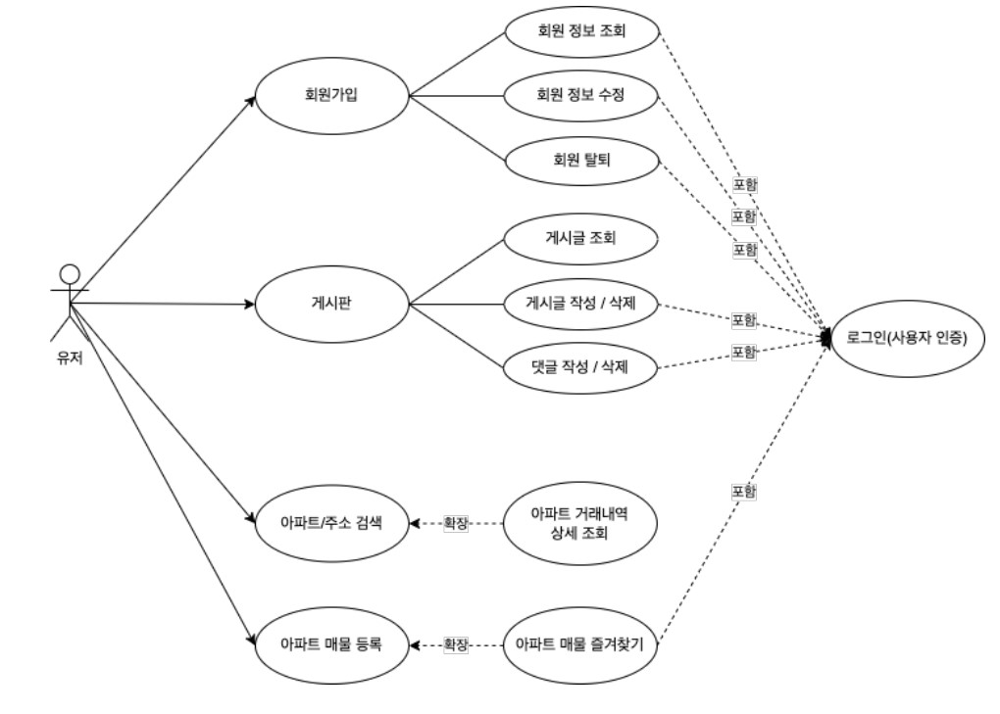
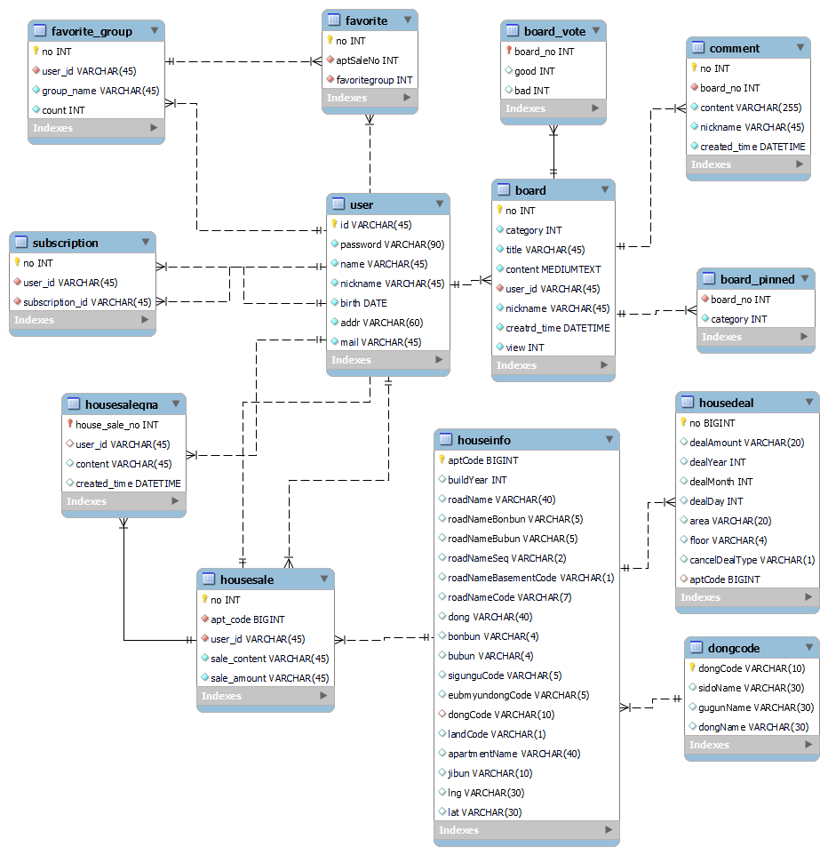
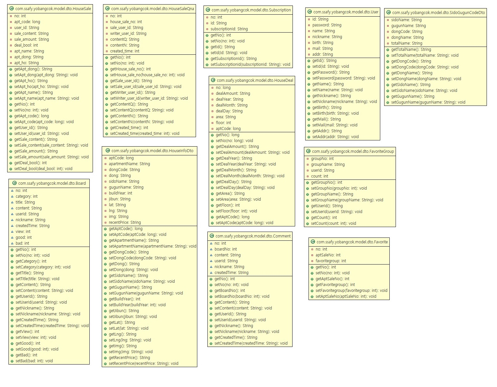
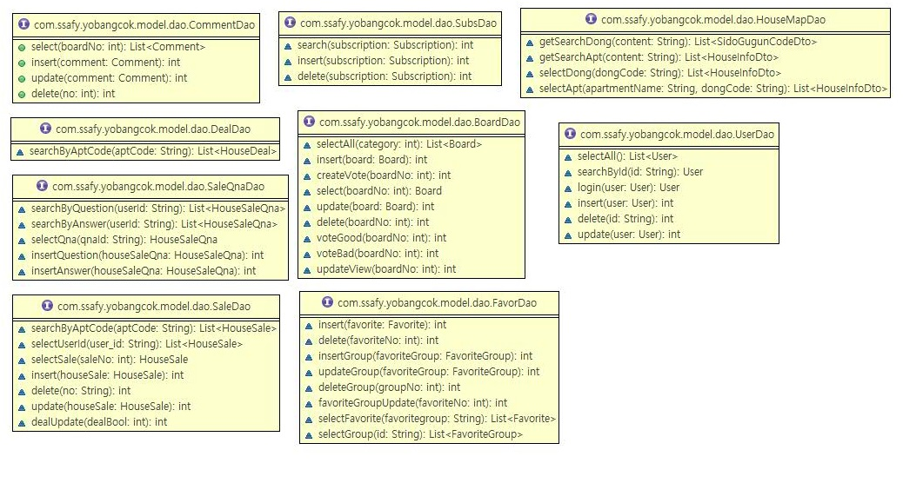
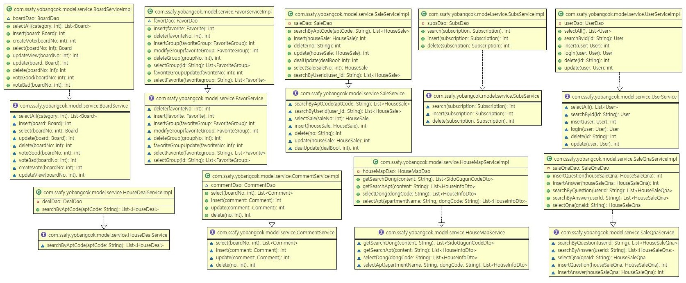
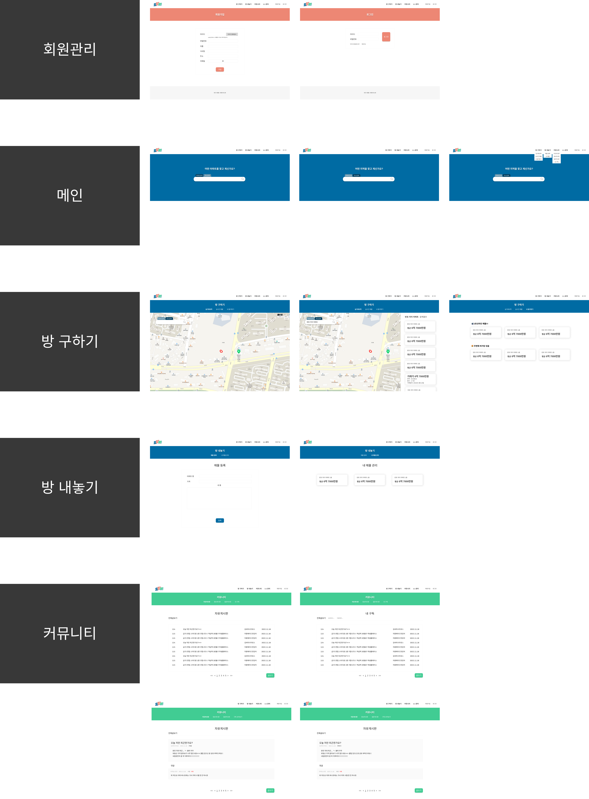

# Happy House

🔔 본 프로젝트는 **삼성 청년 SW 아카데미** 1학기 관통 프로젝트 결과물입니다

  

## **개요**

- 부동산 매물의 다양한 서비스 제공을 목적으로 매물 실거래가, 최신 매물 정보, 실거주자 리뷰, 친구 기능 등을 제공

  

## **프로젝트 기간**

- 2022년 12월 17일 ~ 2022년 11월 24일 (8일)

 
 

## **성과**

🔔 삼성 청년 SW 아카데미 1학기 프로젝트 우수상 수상

  
## **서비스 형태**

Web Application

  

## **기술 스택**

- front-end:  
     
     
      
      

- Back-end:  
    
     

- Database:      
     

  

## **팀원**

<table>
  <thead>
    <tr>
      <th>이름</th>
      <th>역할</th>
      <th>구현 기능</th>
    </tr>
  </thead>
  <tbody>
    <tr>
      <td rowspan="2">유소영</td>
      <td rowspan="2">팀장</td>
      <td>Front-End, Back-End</td>
    </tr>
    <tr>
      <td>Back-End (Rest API 설계, SQL/Spring 디버깅, 이미지 업로드, 매물 조회 게시판 카테고리/키워드 검색 등 필요 API 추가, DB 테이블 수정 등)</td>
    </tr>
    <tr>
      <td rowspan="2">조용장</td>
      <td rowspan="2">팀원</td>
      <td>Front-End, Back-End</td>
    </tr>
    <tr>
      <td>Front-End (메인 페이지 검색창 수정 및 매물 조회 게시판 디자인)</td>
    </tr>
  </tbody>
</table>

  

## **실행 화면**
<figure class="video_container">
   
</figure>

  

## **요구사항 정의서**

  

## **테이블 구조도**

  

## **클래스 다이어그램**
- Controller

- Dto

- Dao

- service

  

## **화면 설계서**
- 피그마를 활용하여 디자인을 꾸밈
    - https://www.figma.com/file/9hzsRC8C6KxjmxxSqNfTXX/YoBangCok?t=d4A7yuX9fUzXL5Ic-0

 

  

