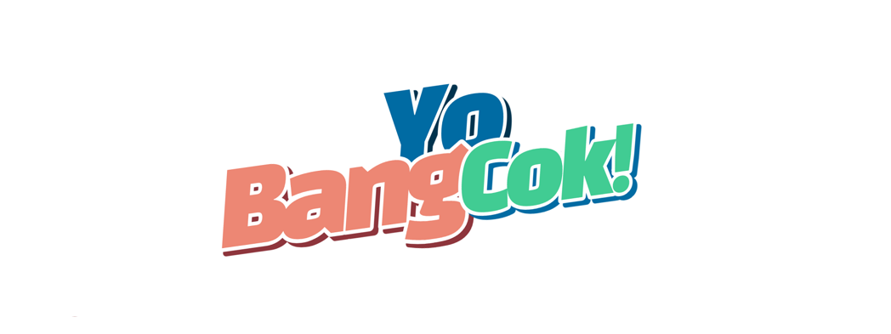

# YoBangCok

## 🏠 프로젝트 개요

부동산 매물의 다양한 서비스 제공을 목적으로 공공데이터 기반 매물 실거래가 조회, 실시간 매물 등록 및 조회, 게시글, 댓글, 좋아요 기능 등을 제공합니다.

 

## ⚙️ 개발 환경 및 기술 스택

### 개발 기간

2022년 11월 17일 ~ 2022년 11월 24일 (8일)

### 서비스 형태

Web Application

### 기술 스택

<table>
    <tr>
        <td valign="center">FrontEnd</td>
        <td valign="center">
                 
                 
                  
                  
         </td>
    </tr>
    <tr>
        <td valign="center">BackEnd</td>
        <td valign="center">
                
                 
         </td>
    </tr>
    <tr>
        <td valign="center">Database</td>
        <td valign="center">
                 
         </td>
    </tr>
</table>

### 개발 타임 라인

### 요구사항 정의서

### 테이블 구조도

### 클래스 다이어그램

- Controller
  
- Dto
  
- Dao
  
- service
  

### **화면 설계서**

- 피그마를 활용하여 디자인을 꾸밈
  - https://www.figma.com/file/9hzsRC8C6KxjmxxSqNfTXX/YoBangCok?t=d4A7yuX9fUzXL5Ic-0

  
